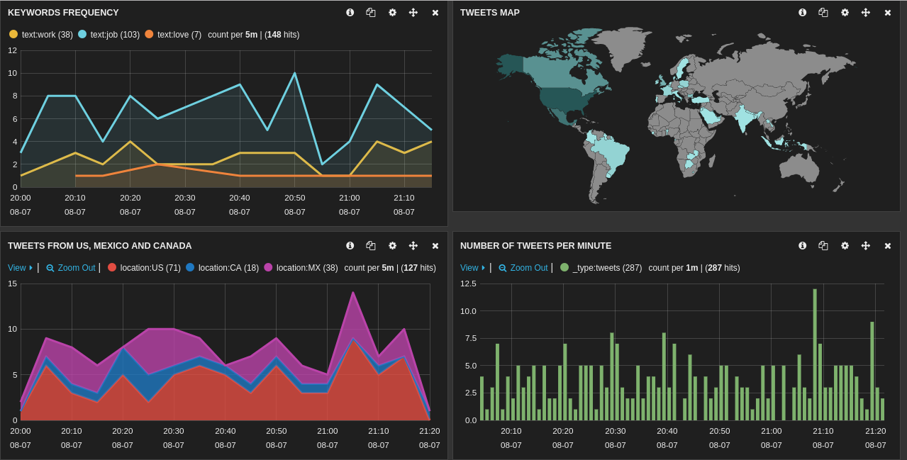

## Receiving and processing twitter data with Spark streaming, storing to Elasticsearch and visualizing with Kibana

### Spark streaming (1.6.1)
A Spark streaming job is connected to the Twitter API and receives the sample twitter data stream. Then, we filter out tweets that:
- are not original tweets (retweeted)
- are not in english
- do not contain geolocation information

### Elasticsearch (1.5.2)
In order to ingest our RDDs to Elasticsearch, we need to create a Map object of each line that will contain the fields we need to store.
Then we use the elasticsearch_spark library as shown below (keeping the same id of each tweet for an Elasticsearch document id):
```
parsedTweet.foreachRDD(rdd =>
   rdd.saveToEs("twitter/tweets", Map("es.mapping.id" -> "id"))
)
```

## Kibana (3.1.2)

Kibana offers a rich set of options for visualizing our tweets. We can choose among pie charts, line charts, histograms, world map, etc.
Some examples can be seen below:


